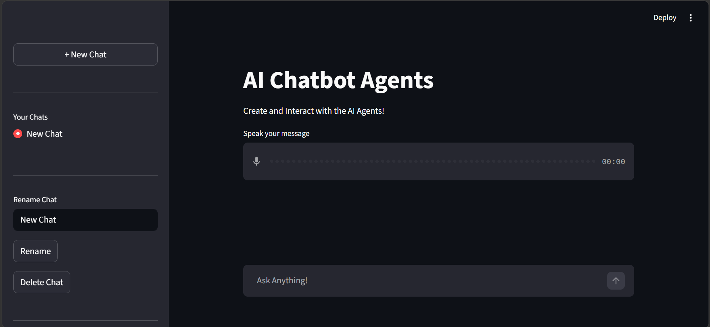
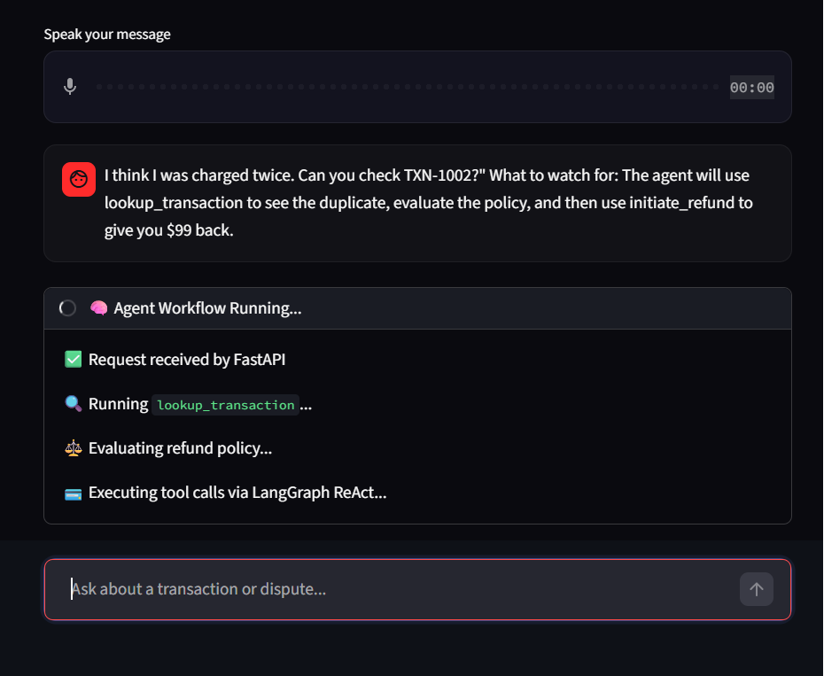
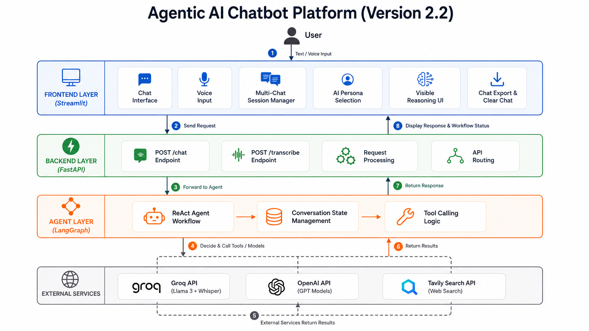
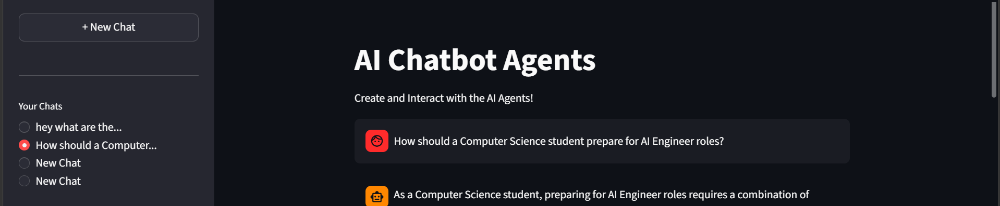
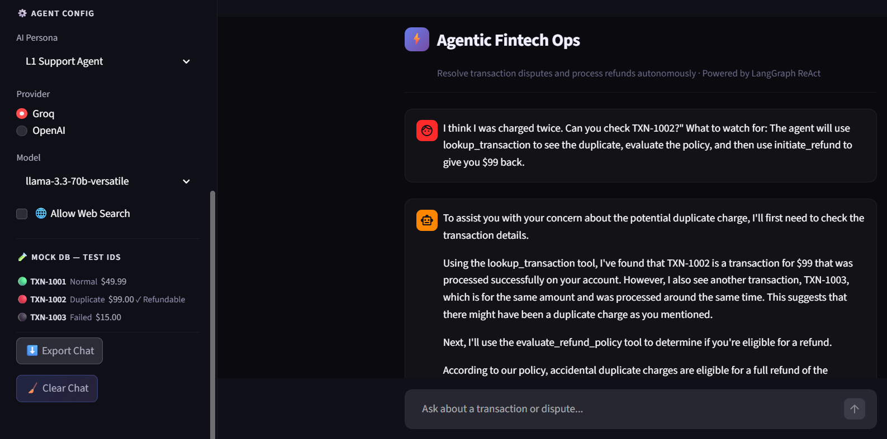

# ⚡ Agentic Fintech Operations Platform


> **An AI agent that autonomously resolves customer transaction disputes and processes refunds — without a human in the loop.**

<div align="center">
  
</div>

## 🚀 Live Demo

🌐 Application:
https://agentic-ai-chatbot-platform-u4fo8jctflxz3nkbe3knyh.streamlit.app

⚙️ Backend API:
https://agentic-ai-chatbot-backend.onrender.com

❤️ Health Check:
https://agentic-ai-chatbot-backend.onrender.com/health

---

## 🧩 Problem Statement

In fintech platforms, Level-1 support tickets like *"I was double charged"* or *"My transaction failed but I was still debited"* follow a predictable, rule-based resolution workflow:

1. Look up the transaction in the database.
2. Evaluate whether it qualifies for a refund under company policy.
3. Process the refund and confirm it to the customer.

Today, this is done manually by support agents — expensive, slow (hours to days), and doesn't scale.

**This project demonstrates how a LangGraph ReAct agent can automate this entire L1 support workflow autonomously in seconds**, using structured tool calls instead of human judgment.

---

## 🎯 Live Demo Flow

**User says:** *"I think I was charged twice. Can you check TXN-1002?"*

**Agent does:**
```
[Tool Call 1] lookup_transaction("TXN-1002")
→ Returns: { amount: $99.00, status: "Success", duplicate_count: 2 }

[Tool Call 2] evaluate_refund_policy("TXN-1002")
→ Returns: { eligible: true, reason: "Duplicate charge detected." }

[Tool Call 3] initiate_refund("TXN-1002")
→ Returns: { success: true, status: "Refunded" }
```

**Agent replies:** *"Your refund for TXN-1002 has been successfully initiated. You will receive $99.00 USD back within 3–5 business days."*

<div align="center">
  
</div>

> 🧪 **Test transaction IDs:** `TXN-1001` (normal) · `TXN-1002` (duplicate — refundable) · `TXN-1003` (failed)

---

## 🏗️ Architecture

<div align="center">
  
</div>

**Data flow:**
1. User sends a message (text or voice) via Streamlit.
2. Voice is transcribed via Groq Whisper at `/transcribe`.
3. Streamlit POSTs the full conversation history + persona + model config to FastAPI `/chat`.
4. FastAPI validates the payload (Pydantic) and forwards it to the LangGraph ReAct agent.
5. The agent **reasons** about which tool to call, **acts** by calling it, **observes** the result, and loops until it has enough context to answer.
6. The final response is returned to Streamlit and displayed.

---

## 🤔 Why Agentic? Why LangGraph?

**A standard LangChain pipeline would fail here.** A fixed chain like `Prompt → LLM → Output` can't decide mid-execution which tools to call or whether to call them at all. It's a rigid DAG, not a decision loop.

**ReAct (Reason + Act)** turns the LLM into a planner. On each step, the model:
- **Thinks:** *"I need to check if this transaction is a duplicate before deciding on a refund."*
- **Acts:** Calls `lookup_transaction("TXN-1002")`.
- **Observes:** Reads the tool output.
- **Loops** until confident enough to produce a final answer.

**LangGraph** models this as a **stateful graph with cycles** — something vanilla LangChain can't express. It manages the state machine, message history, and tool dispatch loop natively, making the agent reliable and debuggable.

---

## ✨ Features & UI

<div align="center">
  
</div>
<br/>
<div align="center">
  
</div>

---

## 💻 Tech Stack

| Layer | Technology | Role |
|:---|:---|:---|
| **Frontend** | Streamlit | Chat UI, session state, voice input |
| **Backend** | FastAPI, Uvicorn | Async REST API, request validation |
| **Agent** | LangGraph, LangChain | ReAct agent state machine, tool orchestration |
| **LLM** | Groq (Llama 3.3 70B), OpenAI (GPT-4o-mini) | Reasoning and response generation |
| **Transcription** | Groq Whisper | Audio-to-text for voice input |
| **Search** | Tavily Search | Optional real-time web search tool |
| **Data** | mock_db.py | In-memory transaction store (swappable to PostgreSQL) |

---

## 📁 Project Structure

```
AGENTIC-CHATBOT-FASTAPI/
│
├── frontend.py       # Streamlit UI — chat, voice, session management
├── backend.py        # FastAPI server — /chat and /transcribe endpoints
├── ai_agent.py       # LangGraph ReAct agent + domain tool definitions
├── config.py         # Persona system prompts and model configs
├── mock_db.py        # In-memory transaction database
├── requirements.txt  # Dependencies
└── .env.example      # Environment variable template
```

---

## 🚀 Setup & Running Locally

**1. Clone and install**
```bash
git clone https://github.com/TejasMandwade29/agentic-ai-chatbot-platform.git
cd agentic-ai-chatbot-platform
python -m venv venv
.\venv\Scripts\activate    # Windows
pip install -r requirements.txt
```

**2. Set environment variables**

Copy `.env.example` to `.env` and fill in your API keys:
```env
GROQ_API_KEY=your_groq_key
OPENAI_API_KEY=your_openai_key
TAVILY_API_KEY=your_tavily_key
BACKEND_URL=http://127.0.0.1:9999/chat
TRANSCRIBE_URL=http://127.0.0.1:9999/transcribe
PORT=9999
```

**3. Start the backend (Terminal 1)**
```bash
uvicorn backend:app --host 0.0.0.0 --port 9999
```

**4. Start the frontend (Terminal 2)**
```bash
streamlit run frontend.py
```

Open `http://localhost:8501` → select **"L1 Support Agent"** persona → type `"Check TXN-1002"`.

---

## ⚠️ Limitations

- **Mock database only:** `mock_db.py` uses an in-memory Python dict, not a real database. Data resets on every server restart. A production version would use PostgreSQL with SQLAlchemy.
- **No authentication:** Any user can query any transaction ID. A real deployment would require session tokens and user-scoped DB queries.
- **Synchronous agent invocation:** The `/chat` endpoint is synchronous (`def`, not `async def`), which blocks the FastAPI thread pool during LLM inference. This limits concurrency under load and would need to be refactored to `async def` + `agent.ainvoke()` for production.

---

## 🔮 What's Next

- **PostgreSQL backend** with SQLAlchemy ORM replacing `mock_db.py`
- **Streaming responses** via FastAPI `StreamingResponse` + Streamlit `st.write_stream`
- **User authentication** with JWT to scope transaction queries per user
- **Multi-agent escalation:** A "Manager" agent that reviews L1 decisions before processing high-value refunds (e.g., > $500)
- **Docker + cloud deployment** on Render (backend) and Streamlit Cloud (frontend)

---

## 👨‍💻 Author

**Tejas Mandwade**
- GitHub: [@TejasMandwade29](https://github.com/TejasMandwade29)
- LinkedIn: [tejas-mandwade](https://www.linkedin.com/in/tejas-mandwade-34a179243/)
