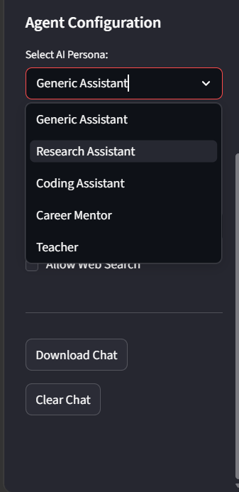

# 🤖 Agentic AI Chatbot Platform


## 📖 1. Project Overview

This is a full-stack AI chatbot application I built to understand how modern AI agents work under the hood. Instead of just making a basic API call to an LLM, this project uses an "agentic" workflow. This means the AI can decide when to use external tools (like searching the web) to answer questions more accurately.

I built this project to showcase my ability to integrate frontend interfaces with backend APIs, manage state in web applications, and work with modern AI frameworks as a Computer Science student preparing for software and AI engineering roles.

**Note:** Currently, chat sessions and memory are managed entirely using the browser's session state. This means your conversation history is isolated per chat, but **it will be lost if you refresh the page**.

---

## ✨ 2. Features

*   **🎤 Voice Input:** Click a microphone to speak your prompt. It uses Groq's Whisper model to transcribe audio to text quickly.
*   **🔍 Visible Reasoning:** Shows a step-by-step checklist of what the AI is doing (e.g., searching the web, generating a response) so you don't have to stare at a loading screen.
*   **🧠 LangGraph Agent Workflow:** The AI can actively decide to use the Tavily Search tool if it needs real-time information from the internet to answer your prompt.
*   **💬 Multi-Chat Sessions:** Create, switch between, rename, and delete multiple independent chat threads, similar to standard chat applications.
*   **📝 Auto Chat Titles:** Automatically generates a short title based on your first message.
*   **🎭 AI Personas:** Choose from pre-written system prompts (like "Coding Assistant" or "Teacher") to change how the AI behaves and responds.
*   **⚙️ Multi-LLM Support:** Switch between Groq (faster) and OpenAI (highly reliable) directly from the sidebar.
*   **💾 Export Chat:** Download your current conversation as a clean text file.

---

## 🏗️ 3. System Architecture


```

**Data Flow:**
1. You type a message or record audio in the Streamlit frontend.
2. If it's audio, it's sent to the FastAPI backend's `/transcribe` endpoint, translated to text via Groq Whisper, and sent back.
3. The text prompt, along with your chat history and settings, is bundled into a JSON payload and sent to the FastAPI `/chat` endpoint.
4. FastAPI passes the data to LangGraph. LangGraph decides if it needs to search the web using Tavily.
5. LangGraph queries the selected LLM (Groq or OpenAI) with the context and any search results.
6. The final text response is sent back to Streamlit and displayed on your screen.

---

## 💻 4. Tech Stack

*   **FastAPI:** Chosen for the backend because it's fast, easy to build REST APIs with, and handles data validation automatically using Pydantic.
*   **Streamlit:** Used for the frontend because it allows for rapid UI development in Python without needing to write custom React or HTML/CSS.
*   **LangGraph:** Used over basic LangChain because it treats agent workflows as graphs, giving more control over the reasoning loop.
*   **Groq & OpenAI:** Groq provides extremely fast inference speeds, while OpenAI acts as a reliable industry standard.
*   **Tavily Search:** A search engine API optimized specifically for LLMs.
*   **Groq Whisper:** Used for fast and accurate audio-to-text transcription.

---

## 📁 5. Project Structure

```text
AGENTIC-CHATBOT-FASTAPI/
│
├── backend.py            # FastAPI server, endpoints (/chat, /transcribe)
├── frontend.py           # Streamlit UI, chat session state, layout
├── ai_agent.py           # LangGraph agent logic, tool setup, LLM configuration
├── config.py             # Centralized settings for Personas and Models
├── requirements.txt      # List of required Python packages
├── .env.example          # Template for environment variables
└── README.md             # Project documentation
```

---

## 🚀 6. Installation & Setup

1. **Clone the Repository**
   ```bash
   git clone https://github.com/YourUsername/agentic-ai-chatbot-platform.git
   cd agentic-ai-chatbot-platform
   ```

2. **Create a Virtual Environment**
   It's highly recommended to use a virtual environment.
   ```bash
   python -m venv venv
   source venv/bin/activate  # On Windows use: venv\Scripts\activate
   ```

3. **Install Dependencies**
   ```bash
   pip install -r requirements.txt
   ```

---

## 🔐 7. Environment Variables

Create a file named `.env` in the main project folder. You can copy the contents of `.env.example`. Add your API keys to it:

```env
# AI Provider API Keys
OPENAI_API_KEY=your_openai_api_key_here
GROQ_API_KEY=your_groq_api_key_here

# Tools API Keys
TAVILY_API_KEY=your_tavily_api_key_here

# Backend Configuration
BACKEND_URL=http://127.0.0.1:9999/chat
TRANSCRIBE_URL=http://127.0.0.1:9999/transcribe
PORT=9999
```

---

## 🏃 8. Running the Project Locally

Because the frontend and backend are decoupled, you need to run them in two separate terminal windows.

**Terminal 1: Start the Backend**
Make sure your virtual environment is active.
```bash
uvicorn backend:app --host 0.0.0.0 --port 9999
```
*Wait until it says "Application startup complete".*

**Terminal 2: Start the Frontend**
Open a new terminal tab, activate your virtual environment again, and run:
```bash
streamlit run frontend.py
```
*A browser window should automatically open to `http://localhost:8501`.*

---

## 📸 9. Screenshots

| Main Chat Interface | Multi-Chat Sessions |
| :---: | :---: |
|  |  |

| Visible Reasoning Workflow | Configurable AI Personas |
| :---: | :---: |
|  |  |

---

## 🧗 10. Challenges Faced

*   **Chat Session Management:** Streamlit redraws the entire UI from top to bottom on every user interaction. Managing multiple chat threads required carefully structuring a dictionary of chats inside `st.session_state` and handling the `st.rerun()` function to avoid infinite execution loops.
*   **Voice Integration:** Handling raw audio bytes from the browser, sending them cleanly via a `multipart/form-data` request to FastAPI, and piping them to Groq's Whisper API required debugging file buffer reading.
*   **Frontend-Backend Communication:** Passing a full conversation history list securely and formatting the schema perfectly between the Streamlit client and the FastAPI `BaseModel` required strict typing.

---

## 🔮 11. Future Improvements

*   **Persistent Database Storage:** Replacing the Streamlit session state with a PostgreSQL database to save chat histories permanently across page refreshes.
*   **Authentication:** Adding user login (e.g., JWT or OAuth) so multiple users can have their own private chat histories.
*   **RAG (Retrieval-Augmented Generation):** Adding the ability to upload PDF documents and chat with them using a vector database.
*   **Cloud Deployment:** Containerizing the frontend and backend using Docker and deploying them to platforms like Render, AWS, or GCP.

---

## 👨‍💻 12. Author

**Tejas Mandwade**
*   LinkedIn: [https://www.linkedin.com/in/tejas-mandwade-34a179243/](https://www.linkedin.com/in/tejas-mandwade-34a179243/)
*   GitHub: [@TejasMandwade29](https://github.com/TejasMandwade29)
*   Portfolio: [Your Portfolio Website URL]
